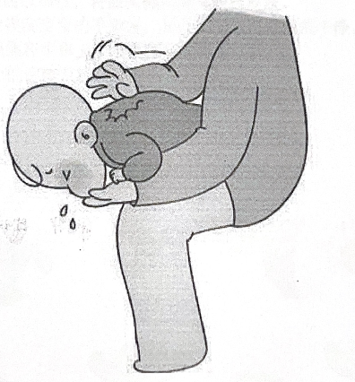

# 实用技能指导

## 一、排气操：婴儿排气操，能快速有效解决宝宝胀气、摄肚、消化不良等肠道问题

因此学习一下是很有实际意义的。注意事项：

1. 做操时间要适当。排气操适合小月龄宝宝做，一定要在吃奶半个小时后做，不然会吐奶。

2. 肠绞痛严重应及时就医。当宝宝肠绞痛的症状较为严重时，妈妈就要警惕宝宝是否属于牛奶蛋白过敏，应该及时带宝宝就医，请医生进行排查。

3. 只放屁不排便要注意。如果宝宝长时间不排便只是放屁，或者所放的屁有酸臭味，那么就要考虑是否是消化不良所致，适当减少奶量进行观察。

4. 此操是利用压迫的原理，将宝宝肚子里的气压缩排出，出现放屁、排便现象都属于正常而且较好的现象，不用慌张。

### 操作前准备：

1. 选择合适的时间。排气操应该在宝宝两次吃奶之间，即吃奶半个小时以后进行。

2. 控制好温度，避免宝宝着凉。室内温度控制在 26℃ 左右，避免对流风。给宝宝做排气操时可让宝宝穿着薄薄的衣服。

3. 如果做排气操时宝宝只穿着纸尿裤，和抚触时一样妈妈要注意在手上搓热后再进行。

4. 给宝宝做排气操前，妈妈要剪短自己的指甲，去掉手上饰品，将双手清洗干净。

### 操作步骤：

1. 乾坤大挪移式：

   - 以肚脐为中心，手掌顺时针轻揉。一圈为一回合，做 4-8 回合即可。

2. 推心置腹式：

   - 双手交替向下轻揉，已 8 拍为一组，做两组。
   - 双手同时向下轻揉，已 8 拍为一组，做两组。

3. 踏单车式：

   - 双腿同时往腹部缩进，已 8 拍为一组，做一组。
   - 两腿交替往腹部缩进，已 8 拍为一组，做一组。

4. 触膝式：

   - 单手单腿交叉相触，已 8 拍为一组，做一组。

5. 垂直抱腿式：
   - 垂直抱起双腿，向上挤压腹部，已 8 拍为一组，做一组。

## 二、吐奶紧急处理

在婴幼期的宝宝，咽喉和吸功能还未发育完善。一旦发生严重吐奶，无法调试呼吸，在紧急情况下，极易发生窒息死亡的悲剧。因此很有必要学习一下如何进行紧急处理吐奶的流程。

1. 在发现宝宝发生吐奶的时候，第一时间，将宝宝的头部向下或者俯卧在床上。

2. 用手掌用力的叩击宝宝两处肩胛骨的中间位置。

3. 反复进行过程中，及时清理口鼻内的异物，避免再次误吸。

4. 在宝宝哭声减弱或者面色青紫的时候，大力的抱起宝宝，让宝宝大哭吸氧气入肺缓解缺氧。

5. 及时送往医院进行紧急处理及治疗。

> 妈妈用手掌根部，在宝宝的肩胛之间用力拍背 5 次，每次都用足够的力量拍打，以尝试清除异物。

### 观察宝宝情况：

- 如宝宝面色红润，哭声响亮，呼吸逐渐平稳，状态良好，则表示无大碍。

- 如宝宝面色青紫，哭声微弱，呼吸不平稳，精神萎靡，四肢抖扎，则表示异物已进入气管内阻碍了呼吸通路。需要及时就医取出异物。

在等待救援的过程中，可持续的使用叩击背部和让宝宝大哭的方法，可以适当缓解缺氧的症状。

## 三、洗澡和抚触

洗澡除了可以清洁皮肤以外，还可增强宝宝的御寒能力。抚触更是一项可以增加亲子间交流的运动。

### 操作准备：

1. 用物准备：

   - 婴儿专用洗护用品
   - 吸水柔小方巾
   - 洗澡时遮盖腹部和胸部的小毛巾
   - 婴儿抚触油
   - 软的浴巾或润肤乳
   - 水温计或手腕测温（手腕处皮肤触感温而不烫）
   - 36-40℃ 的温水
   - 浴网或者浴架

2. 环境准备：

   - 选择在无对流风直吹的房间
   - 室温在 28-30℃，可提前 30 分钟将房间升温
   - 不可开着浴霸，射灯直接照射到宝宝的眼睛
   - 铺有隔尿垫的台面

3. 操作者准备：

   - 最好两个人操作
   - 修剪手部指甲
   - 不可以佩戴手饰

4. 宝宝准备：
   - 在奶后半个小时或一个小时内进行
   - 不在剧烈哭闹时给宝宝操作

### 洗澡流程：

1. 依照从上至下的顺序进行清洗。先用打湿的棉柔巾，在宝宝的左右面部轻柔的划上一个 3 字。用绵柔巾清理眼角、鼻翼、口周等角落缝隙处。

2. 打湿头发，使用少许的洗发露，打圈式揉搓头部，避开前囟门的位置。也可以使用抓挠式清理头部。

3. 用指腹清理宝宝的脖子褶皱，保证能将褶皱内的污物清理干净。

4. 用手掌蘸取少许的沐浴露，起泡后，轻柔的揉搓胸腹部皮肤。

5. 用指腹轻轻揉搓双侧腋窝内，大腿内侧的腹股沟，及手臂大腿褶皱。

6. 用手掌包裹四肢部位，转圈揉搓式清洁四肢皮肤。

7. 手指轻柔的搓洗宝宝的手脚掌，保证指缝也可以清洗干净。

8. 让宝宝前倾靠在手掌上，清洁宝宝的背部皮肤。

9. 最后将身上的泡沫及污物都冲刷干净后出水。

### 抚触流程：

## 四、眼睛分泌物清洗和鼻泪管按摩

### 操作前准备：

1. 每次在清理宝宝眼部分泌物时，千万要注意手的洁净，最好用流动的水清洗。

2. 对宝宝的衣物用品要经常消毒。

3. 在进行按摩时，为减轻父母的紧张和担忧，减少宝宝的哭闹，可用双手先按摩宝宝的脸颊，跟宝宝亲密接触，避免宝宝受到惊吓而大哭。

4. 父母在家做"泪囊区按摩"时，最好由两个人共同完成，在施行泪囊区按摩前，父母应该先把指甲剪干净，把手洗干净。

### 流程步骤：

1. 用烧开后放凉的温水浸泡消毒棉签，等棉签无滴水时对宝宝眼部进行擦拭。

2. 如果宝宝睫毛上粘着较多的分泌物时，可用消毒棉球浸上温开水湿敷一小会儿，再从眼内侧向眼外侧轻轻擦拭，一次换一个棉球，不可重复使用，直到擦干净为止。

3. 用抗生素眼药水滴眼：

   - 妈妈手持眼药瓶，瓶口离眼睛要保持 2 厘米
   - 慢慢将药水滴入宝宝的眼外角，每次 2~3 滴即可
   - 滴完后，妈妈用手轻轻提宝宝上眼皮，以防药水流入鼻腔
   - 如果双眼都需滴药，应先滴症状轻的一侧，间隔 3~5 分钟后，再滴症状重的一侧

4. 泪囊区按摩：

   - 一个人固定宝宝的头部和上肢
   - 另一个人左手扶住宝宝的头
   - 右手大拇指或食指指腹压在内眼角靠近鼻梁最低点处
   - 以均匀的力量往下（往鼻孔方向）按
   - 用食指指腹从眼眦内侧至鼻翼顺着鼻泪管方向从上往下按摩

5. 按摩注意事项：
   - 要有一定力度，应感觉按压在鼻骨上，并有一定的压力感
   - 不能太用力，避免伤害宝宝幼嫩的皮肤和皮下血管
   - 按摩前最好先点抗菌素滴眼液，效果会更好

## 五、宝宝的会阴清洁

男宝宝因为会有包皮过长的现象，会在包皮处藏污纳垢，极易引起尿路感染。女宝宝的会阴处有一层白色厚重的物质，这是属于天然保护宝宝会阴处黏膜的屏障，可以不需要过度清理掉，但是如果宝宝拉了臭臭，粪便沾染了会阴处，该如何清洁呢？

### 操作前准备：

- 无添加的天然油剂或者烧开后放凉的温水
- 棉签
- 洗净双手，修剪指甲

### 操作流程：

1. 让宝宝平卧在台面上，解开纸尿裤或者是在刚清理过大便后。

2. 男宝宝：

   - 将包皮轻轻向后推，暴露出平时看不到的地方
   - 如无法看到尿口，不要用力向后拉扯

   女宝宝：

   - 用大拇指和食指，轻轻将宝宝的大阴唇分开
   - 暴露出小阴唇及大阴唇内侧

3. 男宝宝：

   - 用干净的水冲洗阴茎前端，或者使用棉签将温水吸满
   - 轻柔的将尿道口的尿垢清理干净

   女宝宝：

   - 将棉签吸满油剂
   - 由上之下的顺序轻轻擦拭掉粘附在上面的粪便或污物
   - 注意动作轻柔，并且保证棉签吸满了油剂足够润滑

4. 如一次无法清理干净，可分多次进行清理，避免长时间刺激导致会阴红肿。

## 六、襁褓式包裹睡眠

许多婴幼儿都会因为缺乏安全感而哭闹，需要紧紧的怀抱才可以缓解。但是时间久了，家长们就会疲惫了。这个时候，就可以使用襁褓式包裹来让宝宝安心睡眠。

### 准备物品：

1. 可直接购买襁褓包被进行包裹

2. 使用柔软透气的纱布包被进行包裹

3. 注意事项：
   - 包被上不可以有锐物
   - 不可有直接堵塞宝宝口鼻的物体

### 操作方法：

